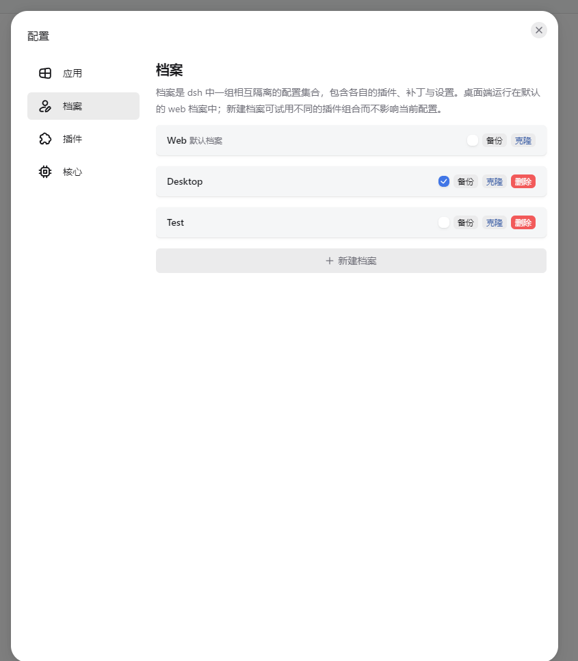

# desktop profile？web profile ？什么意思？ 可配置的？ 档案选择？

## 路径
~/.dsh\profiles
例如：
- ~/.dsh/profiles/web/
- ~/.dsh/profiles/desktop/

## 切换档案（环境）
Tauri 桌面应用 为例子：
配置-档案

## 报错
desktop 环境
Harness 在Plugin installation阶段失败。
最后的就绪状态：INTERNAL_PLUGIN_INSTALL_FAILED: 
PREINSTALL_FAILED: dsh plugin exited with code 1: ERR_PNPM_UNEXPECTED_STORE  Unexpected store location (This error may happen if the node_modules was installed with a different major version of pnpm) 
dsh: pnpm failed in profile directory C:\Users\viaco\.dsh\profiles\desktop

web 环境
发现导致启动失败的插件
插件文件可能损坏、缺少依赖，或与当前 Harness 版本不兼容。
dsh-Identify-local-files